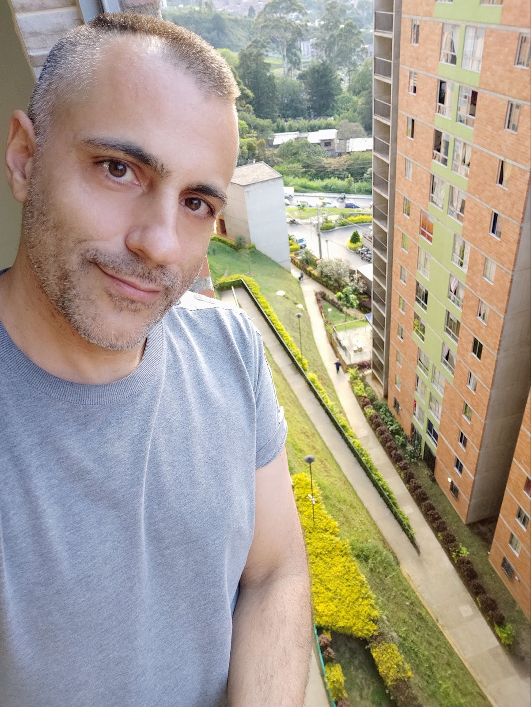
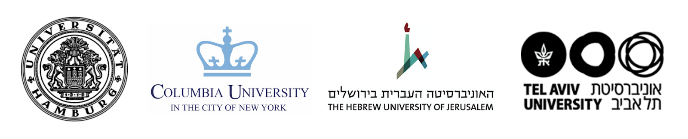
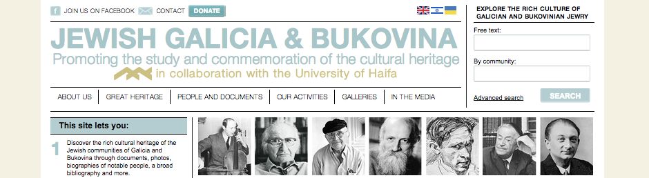
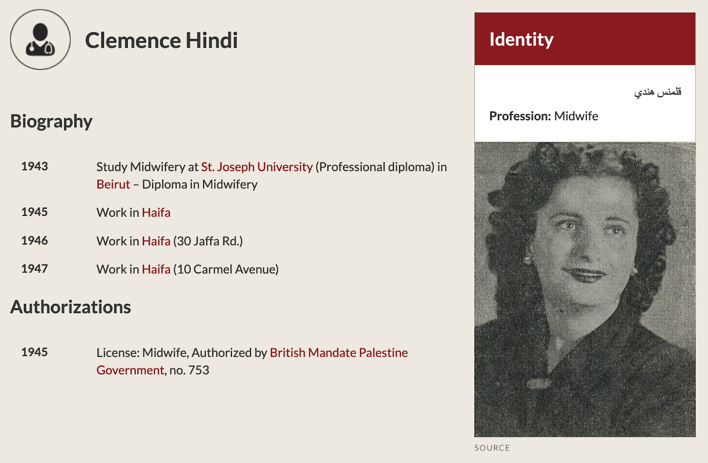
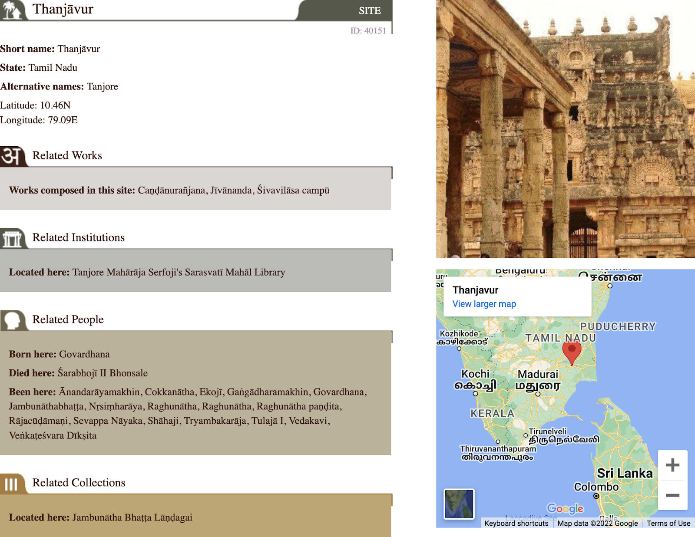
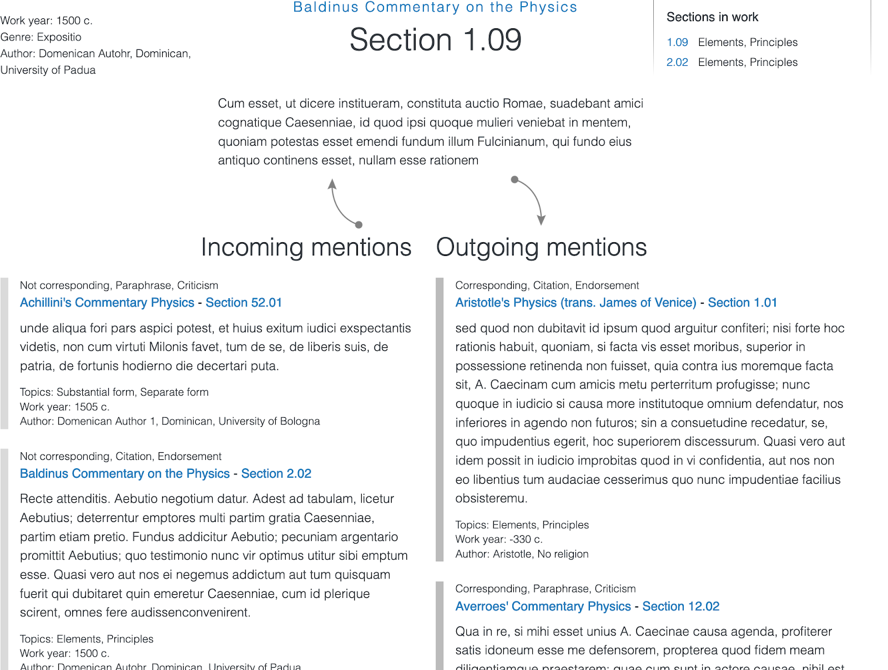
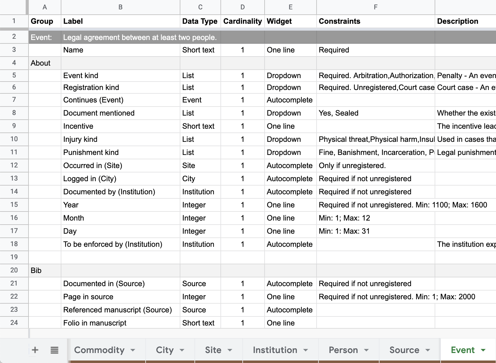

Data Modeling and Website Building in the Digital Humanities

If you are doing research in the humanities or social sciences or have a significant collection of data or images, you need a digital database. I can build it.

My name is Amir Simantov. I empower researchers with the web tools they most need to make an impact on their careers. Together we build digital collections and benefit from crowdsourcing research. I have 18 years of computer programming experience, developing software and building databases. I have also developed and delivered programming courses.

Please feel free to contact me: <wawina@gmail.com>

> *One of the many assets that Amir brings to the table is his unique ability to imagine the unknown capacities and trajectories of a nascent project. As a result of my many deliberations with him, I learned a great deal about what it was I wanted to achieve in the first place and what all more the database can do for me. Amir's intellectual curiosity, his selfless dedication, his uncompromising eye for details, his rigorous documentation, and his ability to think ahead allowed him to become the conscience of the project, often veering me and my team in the right direction and saving us from betraying our own goals and principles. I cannot imagine the PANDiT project without him.*  
> 
> *[Prof. Yigal Bronner](http://yigalbronner.huji.ac.il/){:target="_blank" rel="noopener"}, the Hebrew University of Jerusalem*

<a href="http://yigalbronner.huji.ac.il/" target="_blank">Prof. Yigal Bronner</a>, the Hebrew University of Jerusalem

## What You Gain

Whether you are currently doing research, have an extensive collection of findings, or have a vast catalog, you will probably benefit by having a representation of the data online. It will allow you to manage it efficiently, preserve it, and share it with your colleagues or the larger academic community. Today’s technology enables us to use the Internet for gathering data and checking facts, so we learn much more than we used to and faster. Putting your material online will enable approved users to contribute their data to your research. They might also revise and comment on existing data, helping you to point out issues and possibly even correct errors. This type of collaboration is known as crowdsourcing, and it is making inroads in both the social sciences and the arts and humanities. More and more researchers in a variety of fields have already discovered this powerful process. Your online database can become a center of digital knowledge in your field of expertise.

## Leading Clients

## Work Process
I build an online database by following a properly administered process involving the data curators and the technical team. By joining hands, I ensure that I use the technology skillfully to address the specific requirements of your collection. You are always involved and informed during the process. The process is flexible to your needs, and I will be happy to cater to your needs within the confines of the standing procedures. Listed below are the stages I usually follow in the process of turning your data into a “live” digital database.

> *Amir had a far-sighted vision for our project and meticulously planned out every stage of development. He was accessible and on-task, and he regularly discussed everything with us, down to minor details. We are now thanking him for his insistence on separating structure, content, and presentation and for his patient explanations: we found that Amir designed a database that made it easy to work with complex relations. It was robust and flexible enough to accommodate even unexpected sources of data.*
> 
> *[Prof. Andrew Ollett](https://salc.uchicago.edu/andrew-ollett), University of Chicago*

### First Discussion
In our initial one-hour video meeting, I make sure that I can indeed serve your needs. I get to understand briefly what your datasets are (findings, documents, etc.), what you expect the online collection to achieve, and what your long-term goals are (even your greatest expectations regarding the research or database). If we decide to work together, we move on to the next stage.

### Specifying Structure
You know best what your data objects are and the relationship among them. I will apply this knowledge correctly and funnel it into a computerized system. This process is called "data modeling," in which you are fully involved. You do not need technical knowledge. During our discussions, you provide the necessary information, and we put it to work. We will also discuss your future needs as we are designing the system (even if we don't implement them in the first phase of your project).

### Specifying Behavior
I want to give users an efficient method of using the database. We define the types of users who can use the site and classify their needs. We then define the ways users search for data and how it is best to serve them the results. We also specify how data contributors are authorized to add data to the database and the way the data can be edited and published.

### Specifying Presentation
You want your online database to be attractive and user-friendly. At this stage, we bring in a graphic designer who makes sure that the essence of the database is understood. You may provide links to websites whose graphics you like as a general reference for the look and feel of your online database. The graphic designer comes up with suggestions that you can accept, reject, or ask to change.

### Building
My team and I can now begin constructing the online database. During this stage, I supply you with alternative system configurations. These are usually more minor issues that we did not finalize in previous stages. We have regular meetings where I can explain the alternatives, answer your questions, and share our progress.

### Testing
Once built, we put the database online at a web address known only to you. You then see what it looks like and behaves, testing it using the specified user types. In this stage, you will probably find bugs that we did not catch ourselves; you report them, and I fix them. You can also request some small, last-minute changes, and if at all possible, we will try to make them in this stage.

### Migrating
You may have an existing database in another format, such as an older website, spreadsheets, structured documents, etc. We discuss which datasets to import into the new database and the best way to do so. We do that while maintaining the relationship among the existing data records and preserving the coherence of the new database. We do another round of testing to enable you to check the actual results of the data import and confirm it.

### Going live
You or your peers can now add data to the well-structured database via the easy-to-use interface. You decide whether to make it publicly accessible (and accessible to search engines like Google) or, if you prefer, to restrict it to your peers, who can enter with a username and password. The database is designed and built to serve you permanently and is now active – it can grow both in size and in the number of collaborating contributors.

### Support
I offer ongoing support for clients if they need it. A modern digital database is a "living creature" which should be properly maintained. It includes mostly behind-the-scene operations such as security updates, small server tweaks, etc. I am also available for you if you have any questions or want to discuss new ideas.

### Evolving
I supply documentation files for all the specification stages and the building stage, so you are free to choose your service provider. If you find me suitable and are happy with the services I offer, we can continue working together. A few months after the database has gone live online, you may have more ideas for improving it. We can enhance its performance, change aspects of its presentation and add new content types to its structure.

**We repeat the stages above whenever there is a need to develop and enrich your digital collection database further.**

## Technology
We use a modern content management system called Drupal, which many universities and nonprofit organizations prefer. It is the leading content management system for complex websites and databases. Some organizations using this system are Stanford Law, Harvard, Oxford, MIT, the National Endowment for the Humanities (NEH), the British Council, Amnesty International, and the White House. Drupal supplies an easy and consistent interface for manipulating the stored data. This modern system itself is the fruit of the ongoing crowdsourcing work of many thousands of users, and it is constantly improving and evolving. This open-source system ensures that you are always independently able to choose your service provider.

## Projects Showcase
The research fields below are, of course, just examples, and we can build a database with the correct data types that fit your specific data. Both examples involved importing thousands of data records from older databases while keeping the relationships among the content types intact.

### Culture Heritage Database
The first example is the [Jewish Galicia project](http://jgaliciabukovina.net/) – a genealogy and cultural heritage research project. The new database contains no fewer than ten entity types with various relationships among them. There are entity types like people, communities, organizations, buildings, tombstones, and more. The researchers and I did the project in collaboration with the University of Haifa.

Sample:

### Regional History of Medicine
A yet to fully published, the [MidEastMed project](https://www.mideastmed.org/) []

Sample:

### Prosopographical Database for Indic Texts
Another example is the [Pandit project](https://www.panditproject.org/), that gathers online academic knowledge about Indic literature. This new database includes six main content types with dozens of relationships among them, holding more than 100 properties and 50K+ entities. The project is being done in collaboration with the Hebrew University of Jerusalem.

Sample:

### Commentary Comparison in the Italian Renaissance
A project in progress, "Aristotle’s Physics in the Renaissance" []

Sample:

### Court cases in medieval Germany
The researcher and I are on the data modeling phase.

Sample from the data model documentation spreadsheet:

## Contact
There is no obligation on your part, and after I gain an understanding of your goals, I can give you a brief overview of how your digital database can be done. 
Please contact me now on <wawina@gmail.com> and tell me about your project so we can schedule our first video meeting at a time that suits you best.

Of course, I would appreciate it if you share information about my services with your colleagues.

Thank you!

Amir Simantov

